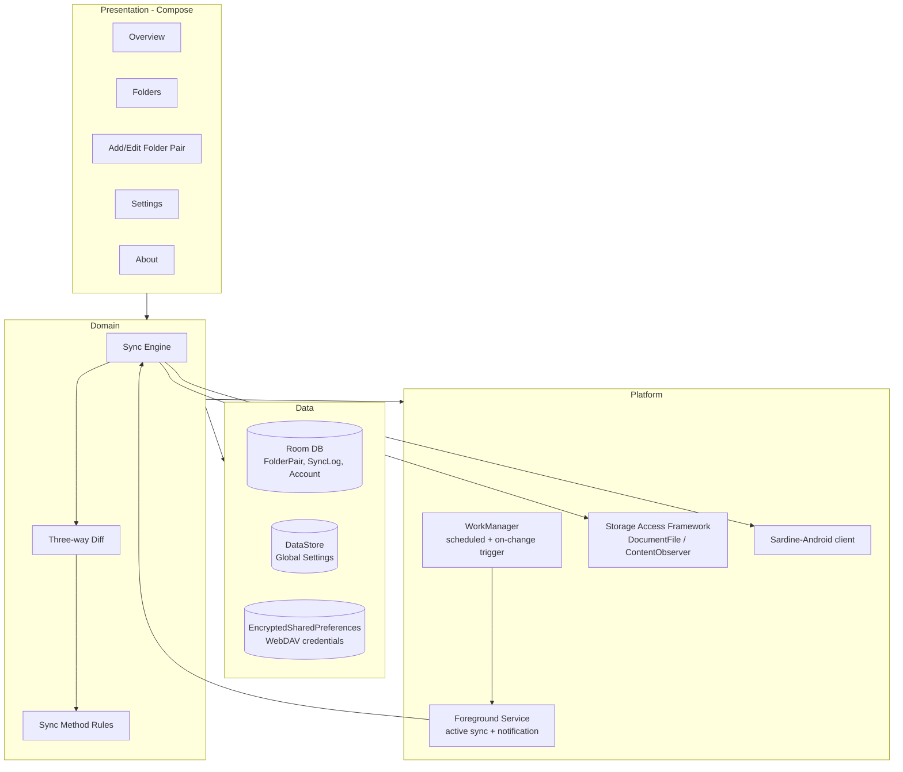

# WebDAV-Sync — Android Development Plan

Based on [requirements.md](requirements.md). Decisions below were confirmed with the project owner; open items are called out explicitly.

## 1. Tech stack

| Concern | Choice | Notes |
|---|---|---|
| Language | Kotlin | |
| UI | Jetpack Compose + Material 3 | Matches the dark, card-based layout in the reference screenshots |
| DI | Hilt | |
| Local persistence | Room (folder pairs, sync log/activity, account) + DataStore (global settings) | Credentials NOT stored in Room — see §4.5 |
| Background work | WorkManager (periodic/triggered sync) + a foreground Service for active transfers | Required for reliable long-running sync post Android 8+ background limits |
| WebDAV client | `com.github.thegrizzlylabs:sardine-android` (OkHttp-based, actively maintained fork of Sardine) | Avoids hand-rolling PROPFIND/XML parsing |
| File access | Storage Access Framework (`DocumentFile`, persistable URI permissions) for local folders | See §4.1 for the scoped-storage trade-off |
| Min/Target SDK | `minSdk 26` (Android 8.0), `targetSdk` = latest stable at release time | Android 8 is required for reliable `JobScheduler`/`WorkManager` background behavior and covers >98% of active devices |
| Distribution | Not published to Google Play — sideloaded / private distribution (direct signed APK) | Decided against a Play Store listing; no Data Safety form, store review, or listing assets needed (Phase 9 skipped, see §5) |

## 2. Architecture



### Suggested package layout
```
app/
  data/
    local/        # Room entities, DAOs, DataStore
    remote/        # Sardine wrapper, WebDAV DTOs, auth
    repository/    # FolderPairRepository, SettingsRepository, AccountRepository
  domain/
    sync/          # SyncEngine, DiffCalculator, ConflictResolver, SyncMethodStrategy
    model/         # Domain models
  sync/
    worker/        # WorkManager Workers
    service/       # Foreground sync Service, notifications
    observer/      # FileObserver / ContentObserver for "immediately on local changes"
  ui/
    overview/
    folders/
    addfolder/
    settings/
    about/
    components/    # shared cards, toggles, etc.
  di/              # Hilt modules
```

## 3. Data model (draft)

- `WebDavAccountEntity`: id, displayName/username, baseUrl, authScheme (`BASIC | DIGEST`, set after auto-detection), trustedCertOrPin (custom CA/cert reference, §4.6), storageQuotaBytes, storageAvailableBytes (refreshed via WebDAV quota `PROPFIND`)
- `FolderPairEntity`: id, **accountId (FK → WebDavAccountEntity)**, name, remoteFolderPath, localFolderUri, syncMethod (`TWO_WAY | TO_DEVICE | TO_CLOUD`), excludeHiddenFiles, **excludedSubfolders (list of relative paths/globs, §4.7)**, deleteEmptyFolders, instantUpload, enabled, lastSyncAt, lastSyncDurationMs, lastSyncStatus
- `SyncFileStateEntity`: id, folderPairId, relativePath, lastSyncedMtime, lastSyncedSize/hash — the three-way baseline used by the conflict-aware diff (§4.2)
- `SyncLogEntity`: id, folderPairId, timestamp, event type (`SYNC_START | SYNC_END | UPLOAD | DOWNLOAD | DELETE_DEVICE | DELETE_CLOUD | CONFLICT | ERROR`), fileCount, message
- Global settings (DataStore): upload/download size limits, warnOnMobileData, wifiOnly, allowParallelTransfers, autoSyncEnabled, autoSyncIntervalMin, syncImmediatelyOnLocalChange, onlyWhileCharging, retryAttempts, retryWaitMinutes, batteryOptimizationDisabled, autoStartOnBoot, diagnosticLogEnabled

## 4. Key architectural decisions & open items

### 4.1 Local folder access — **decided: SAF-only**
Use SAF (`ACTION_OPEN_DOCUMENT_TREE`) with persisted URI permissions per folder pair. No `MANAGE_EXTERNAL_STORAGE` request, keeping the app on the standard Play review path with no special permission disclosure required.

### 4.2 Conflict resolution (Two-way sync) — **decided**
Maintain a per-file **three-way baseline** (last-synced mtime + size, stored alongside `FolderPairEntity`/a per-file sync-state table) so the engine can tell *which side(s)* changed since the last sync, not just compare device vs. cloud directly (avoids clock-skew data loss from naive last-modified-wins):
- Only one side changed → propagate automatically, no conflict.
- Both sides changed since last sync (true conflict) → apply one side and keep the other as a renamed copy, e.g. `file (conflicted copy, device, 2026-08-06).txt` — never silently overwrite or delete.
- One side deleted, the other modified → keep the modified file (resurrect it) rather than delete, and log it.
- Every conflict is written to `SyncLogEntity` so it's visible to the user; a manual conflict-resolution UI is a Phase 11 (Polish) candidate, not MVP.

### 4.3 Instant upload
Requirements mention it as a per-folder-pair checkbox but don't define scope. Assumed to mean: any local change in that folder pair triggers a near-immediate sync (via `ContentObserver`/`FileObserver` + short debounce) instead of waiting for the interval, similar to "Immediately on local changes" in Settings but scoped to one folder pair.

### 4.4 WebDAV auth — **decided: Basic + Digest, with auto-detection**
Server supports Basic, Digest, and Apache (mod_dav via `.htaccess`, which itself serves Basic or Digest — no separate scheme needed). Auto-detection is straightforward and standard:
1. Send an unauthenticated `PROPFIND`/`HEAD` to the base URL.
2. On `401`, read the `WWW-Authenticate` header(s) (server may offer both) and pick a scheme — prefer Digest over Basic if both are offered, since Digest doesn't send the password in the clear (still should be paired with HTTPS regardless).
3. Cache the negotiated scheme per account so subsequent requests skip the probe.
- **Implementation note:** Sardine-Android (OkHttp-based) only handles Basic out of the box. Digest requires adding an OkHttp `Authenticator`/interceptor (e.g. `io.github.rburgst:okhttp-digest`) wired in as a fallback when the probe detects Digest.
- Always enforce TLS certificate validation by default; do not add a blanket "trust all certs" option.
- **Extensibility (recommended, not in MVP scope):** implement auth as a small `WebDavAuthStrategy` interface (Basic/Digest as the initial implementations) behind the `WebDavClient`, so Bearer/OAuth2 (e.g. Nextcloud/ownCloud OAuth) or client-cert (mTLS) can be added later per-account without reworking the sync engine. Not needed now since Basic app-passwords already cover Nextcloud/ownCloud, and mTLS/NTLM aren't relevant to the target server.

### 4.5 Multiple WebDAV accounts — **decided: supported**
`WebDavAccountEntity` becomes a proper one-to-many parent: each `FolderPairEntity` gets an `accountId` FK. The Overview screen's Cloud Storage card either shows the primary/default account or becomes a small horizontally-scrollable list if more than one account is configured (UI detail to refine in Phase 6). "Add folder" gains an account picker (or "Add account" inline action) before the remote-folder browser.

Deleting an account requires **double confirmation** (e.g. confirm dialog → type account name or a second "Are you sure" step) since it's destructive. The second confirmation must also ask **whether to delete the actual files/folders** on both device and cloud, or only remove the account + folder-pair configuration and leave data in place.

### 4.6 Credential storage & TLS trust (security) — **decided**
WebDAV username/password must **not** be stored in plain Room columns or DataStore. Use `EncryptedSharedPreferences` (Jetpack Security) or the Android Keystore-backed encryption, keyed per account.

The server uses a **self-signed or private CA certificate**, so the default system trust store isn't sufficient. Plan:
- Let the user import a custom CA certificate (or pin the server's leaf/intermediate cert) per account during "Add account" — e.g. via a SAF file picker for a `.crt`/`.pem`, or a "trust this certificate" prompt (with fingerprint shown) on first connect, similar to how Nextcloud/ownCloud clients handle it.
- Build a per-account OkHttp `SSLSocketFactory`/`TrustManager` from the imported cert (or pinned public key) rather than a blanket "trust all certs" `TrustManager` — trust-all is an OWASP-flagged anti-pattern (disables MITM protection entirely) and must be avoided even for a "private server" use case.
- Store the imported certificate/pin alongside the account record (not secret, doesn't need encryption, but should be tied 1:1 with the account so removing the account removes the trust entry too).

### 4.7 "Exclude folders" semantics — **decided**
Recursive sync with a **per-folder-pair exclusion list** (user picks/names specific subfolders or patterns to skip, e.g. `.thumbnails`, `node_modules`), rather than a blunt "don't recurse at all" toggle. Requires a small exclusion-list editor in the Add/Edit Folder Pair screen (simple list of relative paths/globs, add/remove rows).

### 4.8 "Delete empty folders" scope — **decided**
Applies to **both** sides after a sync pass: once files are moved/deleted per the diff, walk both the local tree and the remote tree and remove any folder left empty (respecting the exclusion list from §4.7 — never delete an excluded folder even if empty).

### 4.9 App identity
- App name: **WebDAV-sync**
- Contact email (About screen): `hummersoft@vovchenko.org`
- Package ID: placeholder `org.vovchenko.webdavsync` until confirmed — update in Phase 0 `build.gradle` before first release.
- Icons/logo: final launcher icon (adaptive icon foreground/background + legacy mipmaps at all densities) supplied by the project owner and applied 2026-08-06; no placeholder remains.
- Versioning: `versionName` set to `1.0.0` / `versionCode 1` starting 2026-08-06 (first buildable, signed release).

## 5. Phased delivery plan

Effort sizing: **S** ≈ a few focused sessions, **M** ≈ up to ~1 week solo, **L** ≈ multi-week/most complex phase.

### Phase 0 — Project foundation (S) ✅
- [x] Initialize Android project (Kotlin, Compose, Hilt, min/target SDK as above)
- [x] Set up module structure (`settings.gradle.kts`, root/app `build.gradle.kts`, `.gitignore`)
- [x] Wire Hilt (`WebDavSyncApp`), Navigation (bottom nav: Overview / Folders / Settings)
- [x] App theme (dark, matches the [WiFi-VPN](https://github.com/offsyanka99/WiFi-VPN) reference palette) + shared Compose components (`SectionCard`, `LabeledRow`, `ToggleRow`)

### Phase 1 — Data layer (M) ✅
- [x] Room DB: `FolderPairEntity`, `SyncLogEntity`, `SyncFileStateEntity`, `WebDavAccountEntity` + DAOs + migrations
- [x] DataStore for global settings
- [x] EncryptedSharedPreferences credential store (per account) + trusted-certificate store (§4.6)
- [x] Repositories exposing Flow-based reactive queries to the UI

### Phase 2 — WebDAV client integration (M) ✅
- [x] Wrap Sardine-Android behind a small `WebDavClient` interface (connect/test, list, upload, download, delete, mkcol, quota)
- [x] Auth-scheme auto-detection (probe → read `WWW-Authenticate` → pick Basic or Digest) + Digest `Authenticator` integration (`okhttp-digest` or similar)
- [x] Model auth as a `WebDavAuthStrategy` interface (Basic/Digest now) so Bearer/OAuth2 or mTLS can be added per-account later without touching the sync engine
- [x] Custom CA/self-signed certificate trust: import `.crt`/`.pem` or "trust on first connect" with fingerprint confirmation, per-account `TrustManager`/`SSLSocketFactory` (no trust-all fallback)
- [x] Multi-account support: add/edit/remove `WebDavAccountEntity` with double-confirmation + optional data-deletion prompt on account removal, test-connection flow per account
- [x] Quota retrieval for the Cloud Storage card (available/quota, % calculation) per account
- [x] Error mapping (auth failure, network, 4xx/5xx, timeout, cert-untrusted) into domain-level errors

### Phase 3 — Local folder access & change detection (M) ✅
- [x] SAF folder picker + persisted URI permissions per folder pair (helper class; the picker launch itself is UI, Phase 7)
- [x] Local tree enumeration honoring `excludeHiddenFiles` / `excludedSubfolders` (§4.7)
- [x] `ContentObserver`/`FileObserver`-based watcher for "instant upload" / "immediately on local changes"
- [x] Debounce logic (the configured short delay before sync starts)

### Phase 4 — Sync engine (L) ✅
- [x] Remote tree enumeration via `PROPFIND`
- [x] Three-way diff (local vs remote vs last-known-state) to classify add/modify/delete
- [x] Strategy per sync method: `TWO_WAY`, `TO_DEVICE`, `TO_CLOUD`
- [x] Conflict handling per §4.2 default
- [x] `deleteEmptyFolders` post-sync cleanup on **both** device and cloud sides, skipping excluded folders (§4.8)
- [x] Transfer execution with optional parallelism (`allowParallelTransfers`), respecting upload/download size limits
- [x] Retry logic (retry attempts + wait-between-attempts from Settings)
- [x] Write results to `SyncLogEntity` (counts for Upload/Download/Deleted-in-device/Deleted-in-cloud) and update `FolderPairEntity` last-sync fields

### Phase 5 — Background execution (M) ✅
- [x] WorkManager periodic work using the configured interval, constrained by Wi-Fi-only / charging-only / mobile-data-warning settings
- [x] Foreground Service + persistent notification during active sync (with progress)
- [x] Boot receiver to reschedule work (`Auto-start after reboot`)
- [x] Battery-optimization exemption request flow (`Settings > Battery optimization`)

### Phase 6 — Overview tab UI (S) ✅
- [x] Sync status card (Last sync, Duration, Status)
- [x] Recent changes card (Upload/Download/Deleted counts)
- [x] Cloud Storage card (provider, username, URL, storage available/quota)
- [x] Top bar ("Autosync" + add-sync icon), bottom "Sync" button triggering manual sync

### Phase 7 — Folders tab + Add/Edit Folder Pair UI (M) ✅
- [x] Folder pair list (cloud folder, local folder, sync method, enable toggle)
- [x] "Add folder" screen: name, **account picker (or inline "Add account")**, remote picker, local SAF picker, sync method dropdown, the 4 checkboxes + enabled toggle, **excluded-subfolders list editor (§4.7)**, Save
- [x] Edit existing folder pair (reuse Add screen)
- [x] Enable/disable toggle wired to scheduler (disabled pairs skipped by Sync Engine)
- [x] Account management screen (add/edit/remove WebDAV accounts, custom CA cert import, double-confirmation + delete-data-too prompt on removal)

### Phase 8 — Settings UI (M) ✅
- [x] Synchronization screen: size limits, Wi-Fi-only, mobile-network warning, parallel transfers, auto-sync toggle + conditional interval/immediate/charging-only sub-options, retry attempts/wait stepper controls
- [x] Settings screen: battery optimization, unused-app management, auto-start on reboot, diagnostic log toggle, "Share log via…" (enabled only when a log file exists)
- [x] Diagnostic log writer (`DiagnosticLogger`): append-only file under `files/diagnostics/`, gated by `diagnosticLogEnabled`, secret redaction, rotation at 2 MiB; wired into SyncWorker/SyncEngine/TransferExecutor/account connect/boot/notification actions; clear-log control on Settings
- [x] Backup/Restore: export settings+folder pairs to a JSON file (via SAF create-document), import/restore with validation and confirmation before overwrite
- [x] About screen: logo, version (from `BuildConfig`), contact email

### Phase 9 — Play Store release readiness (S) — ❌ Skipped (not publishing to Play Store)
Decided not to publish to Google Play. This phase's tasks (privacy policy, Data Safety form, permission justification write-up, store listing assets, Play Console signing/track) are no longer needed. The app will instead be built/signed and installed directly (sideloaded) or distributed via a private channel (e.g. direct APK, F-Droid, or a private CI artifact) — a release-signing config is still worth keeping for that, just without the Play-specific steps below.
- ~~Privacy policy (required — app requests broad storage/network access)~~
- ~~Data Safety form (what's collected: WebDAV credentials stored encrypted on-device, no analytics unless added)~~
- ~~Permission justification write-up for storage/notification permissions~~
- ~~App icon, feature graphic, screenshots, store listing~~
- ~~Signing config + release build, Play Console internal testing track~~

**Direct-distribution release build (done 2026-08-06):** a release keystore (`release.keystore` + `keystore.properties`, both gitignored) was generated and wired into `app/build.gradle.kts`'s `signingConfigs`/`buildTypes.release`; `./gradlew assembleDebug` and `assembleRelease` both build successfully, producing a signed, installable `app-release.apk`. **Replace the throwaway keystore/password before any real-world distribution.**


### Phase 10 — Testing & hardening (M, ongoing throughout) 🔄
- [x] Unit tests: diff calculator, sync method strategies, conflict resolution, settings/repository logic
- [x] Instrumented tests: Room DAOs, WorkManager (`WorkManagerTestInitHelper`) — run as JVM unit tests via Robolectric (no emulator available in this environment) instead of a `connectedAndroidTest` run; should be re-verified on a real device/emulator too
- [ ] Integration tests against a local WebDAV test server (e.g. Dockerized Nextcloud or a lightweight test WebDAV server) for upload/download/delete/quota — not implemented; needs a running WebDAV server, which this environment can't provision
- [x] Compose UI tests for Overview/Folders/Add-folder/Settings screens — a bottom-nav smoke test is scaffolded in `androidTest`, but Compose instrumented tests require a device/emulator to actually execute, which isn't available here; only one smoke test was added, not full coverage of every screen
- [ ] Manual test matrix: airplane mode mid-sync, app killed mid-sync, large files, deep folder trees, special characters/hidden files, low storage, expired/invalid credentials — inherently manual, must be run by the project owner on a real device

**Security audit + hardening pass (done 2026-08-06):** a full static security audit (`security-audit-report.md`) found 2 Critical / 5 High / 8 Medium / 9 Low findings. Each was re-verified against the live source before fixing (not trusted blindly). Fixed: remote path traversal, "delete data" wiping the whole SAF tree root, unenforced download size limit, full-file-buffering upload (now streamed), missing HTTPS enforcement, no redirect policy, manual sync ignoring Wi-Fi-only/charging, backup rules not excluding the DB/DataStore, an over-broad FileProvider path, SAF grants never released, password retained in ViewModel state + logged via `toString()`, weak backup-import validation, R8 minification disabled (now enabled, verified with a real `assembleRelease`), and the missing `INTERNET` permission. A few items were deliberately deferred/documented only (cert-pinning UX, alpha Jetpack Security version, diagnostic-log redaction — feature isn't wired up yet, dependency/SCA scanning). Full per-finding status is tracked in `security-audit-report.md`'s new "Remediation status" section. While running the unit tests for real for the first time, also found and fixed two unrelated pre-existing bugs: `PathExclusion`'s glob wildcard matching never worked, and `ConflictResolver`'s date formatting was timezone-dependent.

### Phase 11 — Polish (optional, post-MVP)
- [ ] Localization
- [ ] Accessibility pass (TalkBack, content descriptions, contrast)
- [ ] Per-folder-pair sync history/details screen (the "(Details)" link shown in the reference screenshots)
- [x] Notification actions (pause/cancel sync)

## 6. Suggested build order
Phase 0 → 1 → 2 → 3 → 4 → 5 → 6/7/8 (UI can be built in parallel with a fake/in-memory repository once Phase 1 interfaces exist) → 10 (continuously) → 11. Phase 9 is skipped (no Play Store publication).

## 7. Resolved decisions log
1. Conflict resolution for two-way sync — three-way baseline + rename-conflict-copy strategy (§4.2).
2. Local folder access model — SAF-only, no `MANAGE_EXTERNAL_STORAGE` (§4.1).
3. WebDAV auth — Basic + Digest with auto-detection via `WWW-Authenticate` probing (§4.4).
4. Multiple WebDAV accounts — supported; `FolderPairEntity` references an `accountId`, deletion requires double confirmation + optional data-deletion prompt (§4.5).
5. TLS trust — must support self-signed/custom CA certs per account; no trust-all fallback (§4.6).
6. "Exclude folders" — recursive sync with a per-folder-pair exclusion list, not a no-recursion toggle (§4.7).
7. "Delete empty folders" — applies to both device and cloud sides (§4.8).
8. App identity — name "WebDAV-sync", contact `hummersoft@vovchenko.org`, package ID placeholder pending confirmation, icons pending (§4.9).
9. Distribution — will not be published to Google Play; Phase 9 (Play Store release readiness) is skipped in favor of direct/private distribution of a signed APK.
10. App icon finalized and versioning set to 1.0.0; first signed `assembleRelease` build verified working end-to-end (2026-08-06).
11. Security audit performed and remediated (2026-08-06): critical path-traversal and destructive-delete bugs fixed, transport/network-policy hardening applied, backup/provider surface narrowed, R8 minification enabled. See `security-audit-report.md` for the full findings + remediation status.
