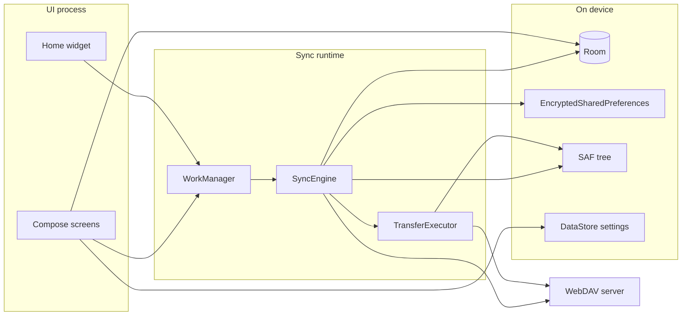
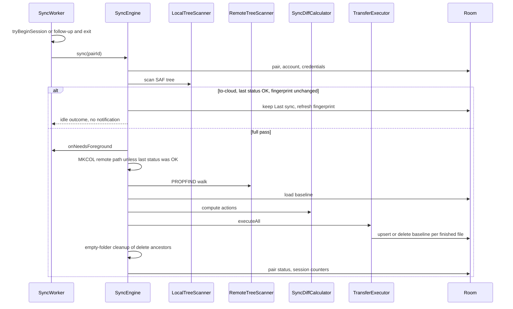
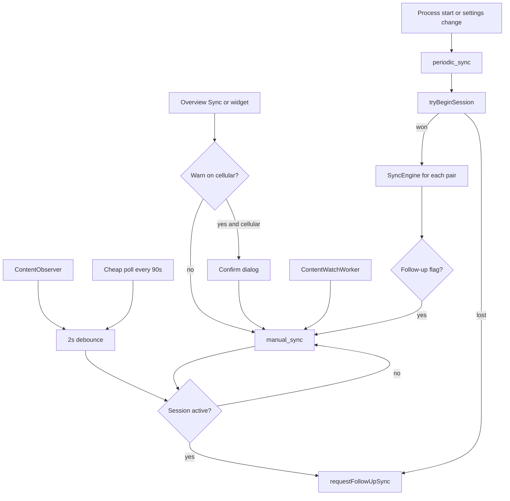

# WebDAV-sync architecture

**App:** `org.vovchenko.webdavsync`  
**Version documented:** 1.1.6 (`versionCode` 16)  
**Platform:** Android 8.0+ (minSdk 26, compileSdk 37, targetSdk 35)  
**Date:** 2026-09-26

This document describes the app as it is implemented in `app/src`. It is the map of processes, data, and the sync pipeline. Defects and recommended changes are recorded separately in `doc/review.md` (kept out of version control).

## 1. What the app does

WebDAV-sync keeps one or more local folders aligned with folders on WebDAV servers. Each link is a **folder pair**: a Storage Access Framework (SAF) tree, a remote path on one account, and a sync method.

A pass can be started by the user, by a periodic WorkManager job, or by a local-change watch. One pass scans the local tree and (usually) the remote tree, compares both to a per-file baseline, then uploads, downloads, or deletes. Credentials never go in the database. The only network endpoints are the WebDAV servers the user adds.



## 2. Technology stack

| Concern | Choice |
|---|---|
| Language / JDK | Kotlin, JVM target 17 |
| UI | Jetpack Compose, Material 3, Navigation Compose |
| DI | Hilt 2.60 (`@HiltAndroidApp`, `@HiltViewModel`, `@HiltWorker`) |
| Database | Room 2.8 (SQLite), schema version 3, schema JSON under `app/schemas` |
| Settings | DataStore Preferences (`settings`) |
| Secrets | `androidx.security:security-crypto` EncryptedSharedPreferences, AES-256 |
| Background work | WorkManager 2.11, foreground service type `dataSync` |
| HTTP / WebDAV | OkHttp 4.12, sardine-android 0.9, okhttp-digest 3.1 |
| Local files | SAF `DocumentFile` only. No `MANAGE_EXTERNAL_STORAGE` |
| Release build | R8 minify + optimize, optional signing via gitignored `keystore.properties` |

Root Gradle plugins live in `build.gradle.kts`. The app module is `app/build.gradle.kts`. Release APK name: `WebDAV-sync-{versionName}.apk`.

## 3. Source layout

```
app/src/main/java/org/vovchenko/webdavsync/
  WebDavSyncApp.kt          process start: WorkManager factory, reschedule, folder watch
  MainActivity.kt           single-activity Compose host and navigation graph
  di/                       Room providers, application CoroutineScope
  ui/                       screens, ViewModels, theme, shared components
  domain/model/             SyncAction, SyncOutcome
  domain/sync/              engine, diff, transfer, policies, overview metrics
  data/model/               SyncMethod, AuthScheme, SyncEventType
  data/local/               Room entities/DAOs, SAF, settings, credentials, diagnostics
  data/remote/              WebDavClient, Sardine adapter, auth, TLS, path checks
  data/repository/          account, folder pair, baseline, logs, connection, settings
  sync/worker/              SyncWorker, scheduler, boot receiver, content watch
  sync/control/             single-flight session, pause/cancel, live progress
  sync/service/             foreground notification
  widget/                   4×1 home-screen widget
  util/                     network status, relative path join
```

Tests are unit tests under `app/src/test` (Robolectric available) plus a small `androidTest` placeholder.

## 4. Process entry and Android components

`WebDavSyncApp` is the `Application`. It implements WorkManager `Configuration.Provider` and supplies a Hilt `WorkerFactory`. The manifest removes `WorkManagerInitializer` so WorkManager does not start with the default factory before Hilt is ready.

On every process start the app:

1. Reschedules periodic sync from the current DataStore settings (`ExistingPeriodicWorkPolicy.UPDATE`).
2. Starts `FolderChangeCoordinator`, which watches folder pairs that opted into instant upload.

Manifest components:

| Component | Exported | Role |
|---|---|---|
| `MainActivity` | yes (launcher, `singleTop`) | UI. Also accepts `EXTRA_REQUEST_SYNC` from the widget when a mobile-data confirm is required |
| `BootCompletedReceiver` | yes, `BOOT_COMPLETED` only | If “Auto-start after reboot” is on, reschedules periodic work |
| `SyncActionReceiver` | no | Pause / resume / cancel from the sync notification |
| `SyncWidgetProvider` | yes | App widget update and `ACTION_SYNC_NOW` |
| `SystemForegroundService` | merged | `foregroundServiceType=dataSync` while a pass is on the network |
| `FileProvider` | no | Shares only `files/diagnostics/` |

Permissions: `INTERNET`, `ACCESS_NETWORK_STATE`, `FOREGROUND_SERVICE`, `FOREGROUND_SERVICE_DATA_SYNC`, `POST_NOTIFICATIONS`, `RECEIVE_BOOT_COMPLETED`, `REQUEST_IGNORE_BATTERY_OPTIMIZATIONS`.

There is no cleartext network-security config. Account URLs must start with `https://`.

## 5. Layers

### 5.1 UI

One activity, Compose Navigation. Bottom tabs:

| Route | Screen |
|---|---|
| `overview` | Last sync, duration, status, recent changes, quota, Sync button |
| `folders` | Folder pairs, enable switch, add/edit/delete |
| `settings` | Menu into sync settings, system settings, backup, about, accounts |

Other routes: `folders/add`, `folders/edit/{folderPairId}`, `accounts`, `accounts/add`, `settings/sync`, `settings/system`, `settings/backup`, `settings/about`.

ViewModels are Hilt-injected and talk only to repositories, `SyncScheduler`, and SAF helpers. They do not speak WebDAV themselves, except account creation and account-deletion cleanup, which go through `WebDavConnectionRepository` / `WebDavClientFactory`.

Overview and the widget share `SyncOverviewMetrics` and `SyncStatusDisplay` so labels and colors stay aligned: OK / Ready (green), syncing (yellow), ERROR (red). “Syncing” is true only while a worker is `RUNNING`. A job that is `ENQUEUED` because Wi-Fi or charging constraints are unmet does not count as in progress.

While a pass runs, Overview prefers in-memory counters from `SyncProgress` (atomics, throttled `StateFlow`). Those counts are not written per file. The finished pass writes one Room summary.

### 5.2 Domain

Stateless policy plus one orchestrator:

| Type | Responsibility |
|---|---|
| `SyncEngine` | One folder pair: load, scan, diff, transfer, log, update pair status |
| `SyncDiffCalculator` | Directory creates, then per-file actions |
| `SyncMethodStrategy` | Two-way, to-device, or to-cloud decision for one path |
| `TransferExecutor` | Run actions, retry, size limits, baseline writes, live progress |
| `ConflictResolver` | “(conflicted copy, device\|cloud, yyyy-MM-dd)” names |
| `RemoteTreeScanner` | Depth-1 PROPFIND walk |
| `EmptyFolderCleaner` | Delete ancestor folders that a delete just emptied |
| `IdleSyncPolicy` | Skip remote work on an unchanged to-cloud tree; ancestor paths for cleanup |
| `RecentChangesCalculator` | Turn `sync_log` rows into Overview / widget counters |
| `SyncOverviewMetrics` | Latest pair timestamp + those counters |

`SyncAction` is the diff output: upload, download, delete local, delete remote, create local dir, create remote dir, conflict. Each file action carries a local-safe `relativePath` and, when the server name differs, a `remoteRelativePath`.

### 5.3 Data

Repositories are thin:

- `WebDavAccountRepository` — Room row plus `CredentialStore` and `TrustedCertStore`
- `WebDavConnectionRepository` — detect auth, test connection, save account, refresh quota
- `FolderPairRepository` — CRUD. Deleting an account cascades pairs, baselines, and logs
- `SyncFileStateRepository` — per-file baseline
- `SyncLogRepository` — event rows and the session summary
- `SettingsRepository` — DataStore `AppSettings`

### 5.4 Sync runtime

`SyncScheduler` is the only place that enqueues work.

| Unique work name | Type | When |
|---|---|---|
| `periodic_sync` | `PeriodicWorkRequest` `SyncWorker` | Auto-sync enabled. Interval ≥ 15 minutes. Flex window is about one quarter of the interval (at least 5 minutes, always shorter than the interval) |
| `manual_sync` | one-shot `SyncWorker` | Overview, widget, follow-up, instant upload |
| `content_watch_{pairId}` | one-shot `ContentWatchWorker` | SAF content-URI trigger for instant upload. Starts a sync only when the root snapshot changed |
| `instant_root_poll` | one-shot `InstantRootPollWorker`, re-armed every 2 minutes | Instant upload is on. Compares the root snapshot even if the provider never notifies |

Constraints (periodic and manual):

- Network: `UNMETERED` when “Wi-Fi only” is on, otherwise `CONNECTED`
- Charging: when “Only while charging” is on
- Battery not low: periodic only, unless “Sync even when battery is low” is on. Manual and follow-up ignore battery-low

`SyncControl` is an in-process single-flight gate. `tryBeginSession()` uses an `AtomicBoolean` so a periodic worker and a manual worker cannot both transfer. The loser asks for a follow-up of the pairs it was going to sync and returns success. A change that arrives while a pass is only queued does not set that flag. Pause polls every 200 ms. Cancel clears pause so waiters wake up.

`SyncWorker` promotes to a foreground notification only when `SyncEngine` is about to do remote I/O (`onNeedsForeground`). A pass that transfers nothing never shows a notification and does not overwrite Last sync or Duration.

## 6. Data model

Database name: `webdav_sync.db`. Version 4. `MIGRATION_1_2` adds `folder_pairs.lastLocalFingerprint`. `MIGRATION_2_3` adds `folder_pairs.lastRemoteScanAt`, `sync_file_state.lastSyncedEtag`, and `sync_file_state.isDirectory`. `MIGRATION_3_4` adds `folder_pairs.lastCheapFingerprint`, `lastFullLocalScanAt`, and `lastContentHashSweepAt`. Schema JSON is exported under `app/schemas`. Room enables foreign keys. There is no destructive fallback: a future version bump needs an explicit migration.

### 6.1 `webdav_accounts`

| Column | Meaning |
|---|---|
| `id` | Autogenerated. Also the key in the credential and certificate stores |
| `displayName` | UI label |
| `baseUrl` | Server root. Must be `https://` at creation time. Stored as the user typed it |
| `authScheme` | `BASIC` or `DIGEST` after the probe. Null until detection succeeds |
| `storageQuotaBytes`, `storageAvailableBytes` | Cached RFC 4331 quota for Overview |

Username, password, and custom CA bytes are **not** columns.

### 6.2 `folder_pairs`

| Column | Meaning |
|---|---|
| `accountId` | FK to account, `ON DELETE CASCADE` |
| `name` | UI label |
| `remoteFolderPath` | Path under the account base URL. Default for new pairs: `/Webdavsync` |
| `localFolderUri` | Persisted SAF tree URI |
| `syncMethod` | `TWO_WAY`, `TO_DEVICE`, `TO_CLOUD` |
| `excludeHiddenFiles` | Default **true**. Applied to the local scan only |
| `excludedSubfolders` | Newline-joined glob list (`Converters`). Matched against relative paths |
| `deleteEmptyFolders` | Default false. After deletes, remove emptied ancestor directories |
| `instantUpload` | Per-pair local-change watch |
| `enabled` | Disabled pairs are skipped by the worker |
| `lastSyncAt`, `lastSyncDurationMs`, `lastSyncStatus` | Shown on Overview via the most recently finished pair |
| `lastLocalFingerprint` | Full-tree fingerprint after a successful to-cloud scan. Used to skip the next remote scan |

### 6.3 `sync_file_state` (baseline)

One row per file path per pair. Unique `(folderPairId, relativePath)`.

| Column | Meaning |
|---|---|
| `relativePath` | Local-safe relative path |
| `lastSyncedMtime` | Local `DocumentFile.lastModified()` after a successful transfer |
| `lastSyncedSize` | Size at that moment |
| `lastSyncedHash` | Column exists. Nothing writes it |

Absence of a row means “this app has never completed a transfer for this path”. Cascades when the pair is deleted. `deleteForFolderPair()` exists and is not called from the editor.

### 6.4 `sync_log`

Append-only history. Kinds: `SYNC_START`, `SYNC_END`, `UPLOAD`, `DOWNLOAD`, `DELETE_DEVICE`, `DELETE_CLOUD`, `CONFLICT`, `ERROR`. `fileCount` is a batch total, not one row per file.

A worker that actually transferred or failed writes a **session summary** on the last pair id: four counter rows plus `SYNC_END` with message `session`, all sharing one timestamp. `RecentChangesCalculator` prefers that batch. `pruneOlderThan()` exists and is never called.

### 6.5 Settings (`AppSettings`)

Stored in DataStore. Defaults for a new install:

| Setting | Default |
|---|---|
| Upload / download size limit | none |
| Warn on mobile network | off |
| Wi-Fi only | off |
| Parallel transfers | on (cap 4, with an upload throttle described below) |
| Auto-sync | on, every 60 minutes |
| Sync immediately on local changes | off |
| Only while charging | off |
| Sync even when battery is low | off |
| Retry attempts / wait | 3 / 1 minute |
| Auto-start after reboot | off |
| Diagnostic log | off |

“Battery saver profile” sets Wi-Fi only, charging only, 180-minute interval, auto-sync on, immediate-on-change off, battery-low sync off. A folder pair’s Instant upload checkbox still registers watches.

### 6.6 Secrets and certificates

- `CredentialStore`: EncryptedSharedPreferences file `webdav_credentials`, keys `account_{id}_username` / `account_{id}_password`. Writes use `apply()`.
- `TrustedCertStore`: raw bytes in `files/trusted_certs/{id}.cert`. Not secret, but excluded from backup. The bytes are added as an extra trust anchor for that account’s OkHttp client, on top of the system CAs.
- Android backup (`backup_rules.xml`, `data_extraction_rules.xml`) excludes the credential prefs, `trusted_certs/`, the Room database (including `-wal` / `-shm`), and the DataStore directory. `allowBackup` is true for everything else.
- User-facing backup JSON (Settings → Backup) stores settings and folder pairs (name, account display name, base URL, remote path, SAF URI, method, exclusions, flags). It does not store passwords, certificates, or baselines.

## 7. Sync pipeline



`SyncEngine.sync` is per pair. The worker loops enabled pairs (or one target pair for instant upload). Pairs run one after another inside the same session.

Timing: `System.currentTimeMillis()` is the “Last sync” wall clock. `SystemClock.elapsedRealtime()` is the duration, so a clock change mid-pass does not distort it.

Failure handling at the engine boundary:

- Missing pair, lost SAF grant, missing account / credentials / auth scheme, scan failure, MKCOL failure: status `ERROR`, one error outcome, no partial “success” timestamp overwrite beyond `finishPair`.
- User cancel or `SyncControl` stop: status `CANCELLED`.
- Coroutine cancellation: `finishPair(..., CANCELLED)` then the exception is rethrown so WorkManager can stop the worker.
- Any other exception: status `ERROR`.

The worker returns `Result.success()` even when pairs reported errors. That is deliberate: `Result.retry()` left WorkManager `ENQUEUED` and the UI stuck on “Sync in process…”. Per-file retries happen inside `TransferExecutor`.

### 7.1 Local scan

`LocalTreeScanner` lists each directory with one `DocumentsContract` query (name, size, mime type, last-modified). A failed query throws, so a provider error is not treated as an empty tree.

- Names starting with `.` are skipped, including their children, when `excludeHiddenFiles` is true.
- `PathExclusion` globs are skipped and not descended into.
- A relative path is the chain of display names (`RelativePaths.joinRelative`).
- The scanner does not rewrite names. The on-disk SAF name is the path key.

`SafFolderAccess.hasAccess` requires a persisted read **and** write grant. `SyncEngine` fails the pair if the grant is gone, instead of treating an empty listing as “user deleted everything”.

### 7.2 Local fingerprint

Two different fingerprints exist:

1. **Full snapshot** (`IdleSyncPolicy.fingerprint`) over the scanned entries. Stored on the pair after a successful pass. This is what an unchanged-tree skip compares.
2. **Cheap root snapshot** (`LocalTreeFingerprint`): one or two SAF queries of the tree root and its immediate children. When it matches the stored value, the last full walk was under 6 hours ago, and the last remote scan was under 24 hours ago, the engine skips the full walk. Nested edits that do not change the root listing are still walked on that 6-hour cadence. The same snapshot is what the 90-second in-process poll and the 2-minute background poll compare. A file added inside a subfolder is invisible to it until the provider updates the parent listing or the full walk runs.

### 7.3 Idle short-circuit

`IdleSyncPolicy.canSkipRemoteScan` is true for two-way, to-device, and to-cloud when all of these hold:

- `lastSyncStatus` is `OK`
- a stored fingerprint exists and equals the fingerprint of this scan
- file mtimes are real (none are 0)
- the last PROPFIND walk was under 24 hours ago

Then the engine does not open a socket, does not PROPFIND, does not MKCOL, and does not show a notification. It also does not overwrite Last sync or Duration. A remote-only edit waits until that 24-hour cap. A later pass that only re-baselines matching files (`RememberInSync`) is treated the same way: fingerprints are kept, Last sync and Duration stay on the last pass that actually transferred.

`canSkipEnsureRemote` skips MKCOL when the last status is already `OK`, on the assumption the remote root was created last time.

### 7.4 Remote scan

`RemoteTreeScanner` lists with Depth 1 and recurses into collections. For each child:

- The display name is the last decoded href segment (`DavHref`). `+` is not treated as a space.
- Excluded globs are not descended into.
- Hidden names are skipped, including their children, when `excludeHiddenFiles` is true.
- The child URL is `RemotePaths.join(parent, name)`, then `WebDavPathSafety.sanitize`. A `.` or `..` segment throws and fails the scan.
- If sanitizing the child yields the same path as the parent, the child is skipped (guards a self-href that escaped the list filter).

`SardineWebDavClient.list` drops the collection’s own href (`DavHref.isSelf`) so the folder is not walked as `name/name`.

There is no depth cap and no file-count cap. The whole tree is held in memory, then the whole action list.

### 7.5 Path identity

`LocalNameSanitizer` rewrites `\ * ? " < > | :` to `_` and trims trailing spaces and dots, so a SAF provider that mangles a remote name still matches the baseline. The diff map key for remote entries is the sanitized path. The original server path is kept on `RemoteFileEntry.relativePath` and sent back as `remoteRelativePath` for HTTP.

`WebDavPathSafety.sanitize` is the single check inside `SardineWebDavClient.resolve`: split on `/`, drop empty segments, reject `.` and `..`, join. `resolve` then appends each segment with OkHttp `addPathSegment` (percent-encoding) under the account base URL. Collection operations (list, MKCOL, exists, quota) use a trailing slash. PUT, GET, and DELETE do not.

Redirects are disabled (`followRedirects` and `followSslRedirects` are false) so an authenticated client cannot be sent to another origin.

### 7.6 Diff

Directories and files are separate. Directories have no baseline.

**Directories.** Union of local dir paths and sanitized remote dir paths, shallowest first.

| Method | Missing locally | Missing remotely |
|---|---|---|
| Two-way | create local | create remote |
| To device | create local | leave |
| To cloud | leave | create remote |

The diff never emits “delete directory”. Directory removal happens only in `EmptyFolderCleaner`, and only for ancestors of files deleted in this pass, and only when the pair has `deleteEmptyFolders`.

**Files.** `SyncMethodStrategy` classifies each side against the baseline:

- No baseline and entry present → `NEW`
- Baseline and entry missing → `DELETED`
- Local present: `MODIFIED` when size differs or mtime differs by more than 2 seconds (`MTIME_TOLERANCE_MS`)
- Remote present: `MODIFIED` only when **size** differs. Remote mtime and ETag are ignored, on purpose, because server `Last-Modified` often disagrees with the stored local mtime and used to cause false conflicts

Two-way matrix (simplified):

| Local | Remote | Action |
|---|---|---|
| unchanged | unchanged | none |
| new or modified | unchanged | upload |
| deleted | unchanged | delete remote |
| unchanged | new or modified | download |
| unchanged | deleted | delete local |
| deleted | deleted | none |
| deleted | new or modified | download (keep the edited side) |
| new or modified | deleted | upload |
| both present, sizes equal | | none, even if mtimes differ |
| both present, sizes differ, looks like a partial transfer | | upload the larger, or download if remote is larger |
| otherwise both changed | | `Conflict`, newer mtime wins, tie goes to local |

“Looks like a partial transfer” means: the path is already a conflicted copy, or there is no baseline and both sides are `NEW`, or the baseline size equals the larger side and the other side is smaller.

To-device and to-cloud do **not** use that three-way table. They compare the two live trees directly:

- To device: download when the remote file is missing locally, or when size or mtime (2 s) disagrees. Delete local only when a baseline exists, the remote file is gone, and the local file is still there. Local-only files with no baseline are left alone.
- To cloud: mirror image. Upload on local-only or on size/mtime disagreement. Delete remote only when a baseline exists and the local file is gone.

### 7.7 Transfers

`TransferExecutor.executeAll`:

1. Directory actions, in order, on the calling coroutine. A failed MKCOL or `createDirectory` increments errors and the file phase still runs.
2. File actions in parallel on `Dispatchers.IO`, bounded by a semaphore.

Parallelism is 1 when “Allow parallel transfers” is off, otherwise 4, then possibly forced back to 1. The throttle trips when any upload is ≥ 2 MiB, or the upload batch is ≥ 32 MiB, or there are at least 4 uploads. That exists because parallel full-file staging used to hang large FLAC batches. Uploads now stream from SAF with a known `Content-Length`. `openContent` is called on every OkHttp `writeTo`, so a Digest 401 can re-read the file without a cache copy. The `uploadCacheDir` constructor argument is unused.

Per file:

| Action | Behavior |
|---|---|
| Upload | Skip empty files and files over the upload limit. PUT. On HTTP failure, delete the remote object if its listed size is smaller than the local file. Re-stat locally; refuse to baseline a file that became empty. Baseline stores the local size and mtime |
| Download | Skip when PROPFIND size is already over the download limit. Stream to SAF (`"wt"`). If a limit is set, stop and delete the partial when the stream exceeds it. On coroutine cancel before baseline, delete the partial. Baseline uses the **local** mtime after write, not the server mtime |
| Delete local | `DocumentFile.delete`, then drop the baseline. The boolean result is ignored |
| Delete remote | DELETE. HTTP 404 counts as success. Other failures retry. Baseline dropped on success |
| Conflict | Copy the losing side aside, apply the winner (upload or download), then try to upload the conflict copy in the same pass. A conflict path is never given another “(conflicted copy)” layer; it is repaired by size instead |

Retries: `retryAttempts.coerceAtLeast(1)` attempts, then `delay(retryWaitMinutes)`. Non-retryable results (`Skipped`, success) return immediately. `CancellationException` is rethrown **if it escapes** `executeFileAction`. WebDAV calls go through `runCatchingWebDav`, which catches every `Exception` (including cancellation) and returns `Result.failure`.

Size limits are global settings, in bytes. The UI edits them as megabytes. Null means no limit. Conflict preservation downloads the remote loser with `copyTo` and does not consult the download limit. Conflict winner downloads are invoked with `remoteSizeBytes = 0`, so the pre-check is skipped; the streaming check still applies when a limit is set.

Live progress counts uploads, downloads, and deletes. A conflict also counts as an upload or a download of the winning side. Skips and failures do not move the counters. The worker’s session summary is the number Overview keeps after the pass. An all-zero pass does not replace the previous summary. An idle follow-up does not overwrite Last sync / duration (`SyncOutcome.isIdleNoOp` and an empty action list).

### 7.8 Empty folders

After a non-cancelled pass, if the pair allows it, `IdleSyncPolicy.ancestorDirectories` builds parent paths of deleted files, deepest first. `EmptyFolderCleaner` deletes a directory only when it is empty and not excluded. Remote emptiness is “PROPFIND children is empty”.

### 7.9 WebDAV operations

`WebDavClient` surface: `testConnection`, `list`, `upload`, `download`, `delete`, `createDirectory`, `exists`, `getQuota`.

`WebDavClientFactory` builds one OkHttp client per account for a sync pass (`WebDavClientSession`), and closes it when the pass ends so idle sockets do not keep the radio up. A derived client shares that pool for listings and other metadata calls, with a 60-second call timeout. Body transfers use the shared client with:

- Connect timeout 30 s
- Read and write timeouts 30 min
- Call timeout 6 h
- TLS from `TrustedCertTrustManagerFactory` (system issuers copied into a `KeyStore`, plus the optional imported certificate)
- Auth strategy applied after TLS

Auth probe (`AuthSchemeDetector`): unauthenticated `PROPFIND` `Depth: 0`. On 401, Digest wins if any `WWW-Authenticate` value starts with `Digest`; otherwise Basic. Any non-401 response selects Basic.

Basic auth attaches `Authorization` on every request. Digest uses `okhttp-digest` with a per-client challenge cache.

Quota is a raw `PROPFIND` for `quota-available-bytes` and `quota-used-bytes`. Negative RFC 4331 sentinels become “unknown”. Total is available + used when both are present. A failed refresh keeps the previous stored numbers.

HTTP failures are classified by `WebDavErrorMapping` using exception type, or by scraping a 3-digit 4xx/5xx out of the message text.

## 8. When sync runs



Instant watch is on for an enabled pair when its Instant upload checkbox is on, or when global auto-sync and “sync immediately on local changes” are both on and the battery-saver profile is not (`InstantWatchPolicy`). The checkbox still watches while battery saver is on.

Watch layers, cheapest signal first:

1. `FolderChangeObserver` on the tree URI and the child-documents URI, recursive, while the process is alive. Callback hops off the provider thread onto the app scope.
2. `ContentWatchWorker`, a one-shot WorkManager job with `addContentUriTrigger` (60 s update delay, 10 min max delay). The worker re-arms itself with `APPEND` (a `REPLACE` would cancel the running worker). It enqueues `manual_sync` for that pair only when the cheap root snapshot differs from the one stored at the last full scan. The watch itself has no network constraint, so it can re-arm offline. The transfer still has the normal Wi-Fi / charging constraints. A second trigger while that sync is only queued does not schedule another pass.
3. A 90 s in-process poll of `LocalTreeFingerprint` for every watched pair, plus a WorkManager check every 2 minutes (`instant_root_poll`) so a copy is noticed even when the storage provider never notifies and the app process is not running.
4. Periodic `SyncWorker` as the backstop.

During an active session, local changes do not cancel the pass. They set the follow-up flag and refresh the in-memory fingerprint so the poller does not immediately fire again. After the pass, `reseedAfterSync` updates fingerprints and starts a 15 s per-pair cooldown so the files the sync itself just wrote are not treated as a new user edit.

`enqueueImmediateSync` uses `ExistingWorkPolicy.KEEP` and will not `REPLACE` a running pass. A follow-up is recorded only while a session is already active, and it names the pair that changed. A manual job that is only queued is left alone, because that pass has not scanned yet. The follow-up is enqueued from the worker `finally` block with `APPEND_OR_REPLACE` on `manual_sync`, which is a different unique name from the periodic job.

Mobile-data warning (`ManualSyncStarter`) applies only to Overview and the widget. Scheduled sync and instant upload do not show it. “Wi-Fi only” is the control that actually withholds those transfers.

Pause, resume, and cancel are notification actions delivered to the non-exported `SyncActionReceiver`, which flips `SyncControl`. Checkpoints sit between pairs, before the remote scan, between directory actions, and before each file attempt.

## 9. Account lifecycle

Add account (`WebDavConnectionRepository.addAccount`):

1. Reject any base URL that does not start with `https://`.
2. Build a probe client with the optional certificate.
3. Detect Basic vs Digest.
4. Build an authenticated client and `testConnection` (`PROPFIND` on the base URL as a collection).
5. Read quota if the server supports it.
6. Insert the Room row, save credentials, save the certificate.

The password is cleared from `AddAccountViewModel` state after a successful save. Certificate bytes are read fully into memory in the ViewModel before save; parsing happens later inside the trust factory.

Delete account is a two-step dialog. The optional “also delete the files” path:

- Deletes **children** of each pair’s SAF root (`LocalFileIo.deleteContents`), not the tree-root document itself.
- `DELETE`s each pair’s `remoteFolderPath`.
- Releases the SAF grant when no remaining pair uses that URI.
- Then deletes the account row, credentials, and certificate. Folder pairs and baselines cascade.

Editing a folder pair keeps Last sync, duration, and status when the remote path string is unchanged, and keeps the local fingerprint when the SAF URI is unchanged. The baseline table is left as-is in every edit path, including account, path, and method changes.

Deleting a pair removes the row (cascade baseline and logs) and releases the SAF grant if no other pair still uses that URI. It does not delete files. The confirm dialog says so.

## 10. UI backup and restore

Export writes pretty-printed JSON (`version: 1`) to a user-chosen URI: settings plus folder pairs.

Import reads at most 5 MiB, checks the version, replaces settings field-by-field (missing booleans keep the current value), then:

1. Keeps a pair only when an existing account has the same `baseUrl` string, the remote path passes `WebDavPathSafety`, and the SAF URI still has read/write access.
2. Releases SAF grants for **every current pair**.
3. `deleteAll()` pairs.
4. Inserts the kept pairs.

Pairs that fail the check are skipped and counted in the toast. Restore does not append. Credentials are not in the file; the matching account must already exist on the device.

## 11. Diagnostics

`DiagnosticLogger` writes `files/diagnostics/diagnostic.log` when the setting is on. Lines are redacted (`DiagnosticRedactor`: `Authorization`, `password=`, Basic/Bearer tokens, URL userinfo passwords) and also mirrored to logcat. Each line is `fsync`’d. The file rotates by keeping the latter half after 2 MiB. Share uses `FileProvider` with `FLAG_GRANT_READ_URI_PERMISSION`. Logging must not crash the sync path; write failures are swallowed after a logcat warning.

The log includes pair names, remote paths, account base URLs, and relative file paths. It is meant for the user to send while debugging.

## 12. Widget

`sync_widget_info.xml` is a 4×1 home widget (`targetCellWidth=4`, `targetCellHeight=1`), resize horizontal, `updatePeriodMillis=0` (the system does not poll it). Updates are pushed from the worker and from `onUpdate` / the Sync button.

The Sync button sends an explicit immutable broadcast `ACTION_SYNC_NOW` to `SyncWidgetProvider`. On cellular with the warning enabled, the widget starts `MainActivity` with `EXTRA_REQUEST_SYNC` so Overview can show the same confirm dialog. Otherwise it enqueues `manual_sync`.

`requestUpdate(..., forceIdle = true)` from the worker `finally` block paints “not syncing” even if WorkManager still lists the worker as `RUNNING` for a moment. That avoids a sticky “Sync in process…” after an error.

## 13. Security boundaries (as built)

These are properties of the current design, not a claim that every edge is safe. The review file lists gaps.

- Passwords are not in Room, DataStore, or the export JSON.
- TLS is required for new accounts. Redirects are off. There is no trust-all `TrustManager`.
- An imported certificate is an additional trust anchor for that account’s client only. Hostname verification stays on the platform default.
- Remote path segments `.` and `..` are rejected before the URL is built. Href handling uses the last path segment and rejoins it under the current folder, so a PROPFIND href that points at another host is not fetched as that URL.
- SAF is the only local filesystem access. Grants are persisted on pick and released when the last pair using them is removed.
- Backup transport is told to skip the database, DataStore, credentials, and custom certs.
- The sync notification receiver is not exported. Its `PendingIntent`s are explicit and immutable.
- Release builds are minified (R8). Sardine, XmlPull, and okhttp-digest are kept because they reflect.

## 14. Build, test, and configuration

```bash
./gradlew :app:assembleDebug
./gradlew :app:testDebugUnitTest
./gradlew :app:assembleRelease   # needs keystore.properties when a signed APK is required
```

`keystore.properties` and `*.keystore` / `*.jks` are gitignored. ProGuard rules keep the WebDAV stack; there are no app-class keep rules.

Unit tests cover diff cases, conflict names, idle policy, scheduler constraints, folder-change decisions, overview metrics, path sanitizing, and Room DAO behavior. They run on the JVM with Robolectric where Android APIs are required.

## 15. Operational facts worth remembering

- A file becomes “known” when a transfer or a `RememberInSync` result writes a baseline row (size, mtime, and ETag or content hash when the server or the clock does not make a later edit visible).
- Two-way, to-device, and to-cloud can skip the network when the full local fingerprint is unchanged, mtimes are real, the last status is OK, and the last remote scan is under 24 hours old. A remote-only edit waits for that cap.
- One-way sameness uses that baseline, not a raw local-mtime versus remote `Last-Modified` compare.
- Overview status is ERROR if any enabled pair’s last status is ERROR. Otherwise it is the status of the pair with the newest `lastSyncAt`.
- Renames are delete-plus-add. There is no move detection.
- The app will not follow an HTTP redirect to a canonical WebDAV URL. The saved base URL has to be the URL that answers `PROPFIND` directly.
